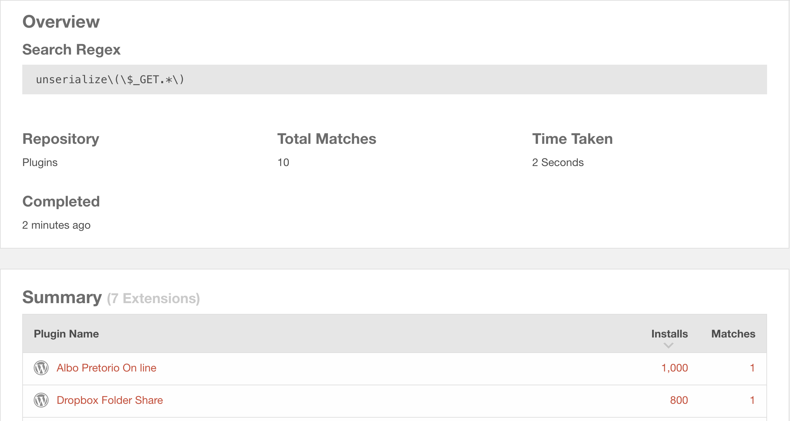

In this article, we will be covering some WordPress-related quirks that we can use to make our hacking more efficient and easier.

## Browsing Source Code

For all the open-source plugins in the WordPress repository, we can browse through their source code using a tool called [Plugin Subversions (SVN)](https://plugins.svn.wordpress.org). It contains the source code for all the plugins that are available at https://wordpress.org/plugins.

Similarly, [Themes SVN](https://themes.svn.wordpress.org) is there for all the themes hosted at https://wordpress.org/themes.

### How to use the SVN?

The SVN is divided into four subcategories:

#### 1. Assets

This section contains all the images, gifs, videos, audios and other static contents needed for the plugin. We can ignore this section as there is nothing important here.

#### 2. Branches

The branches are used to store the latest development code for each major release. Any minor releases are updated with the code for that branch. This section is also not particulary interesting for us.

#### 3. Tags

The tags contains the each snapshot of the version of the plugin. If the plugin is currently at 1.8 and we want the source code of the version 1.1, we can navigate to the tags section and get the source code for that particular version.

You can browse through the tags of [Elementor](https://plugins.svn.wordpress.org/elementor/tags) as an example. 

#### 4. Trunks

The Trunks section has the latest development code in the plugin. We can browser the code in a similar fashion to the tags, except that only the latest code version will be available.

Now that we have a brief idea of all the sections of the SVN, we can easily browse the code of any version of the plugin without having to download it through the WordPress plugin directory.

## Mass-hunting Code Patterns

Let's assume that you found a code pattern that leads to a certain vulnerability which exists across mulitple plugins/themes. How do you mass-scan the vulnerability across the WordPress repository?

There is a site called [WPdirectory](https://wpdirectory.net) that allows you to search for regex pattern across the plugins/themes.

For an example, we want to look for `unserialize()` function being used in the plugin that takes in user-input from the GET parameter potentially leading to PHP object injection. This would be the regex to achieve that goal: `unserialize\(\$_GET.*\)`

Similarly, we can create our own regex pattern as per our requirements and mass-search for the pattern using WPdirectory.

